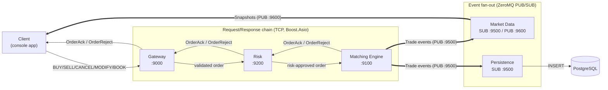
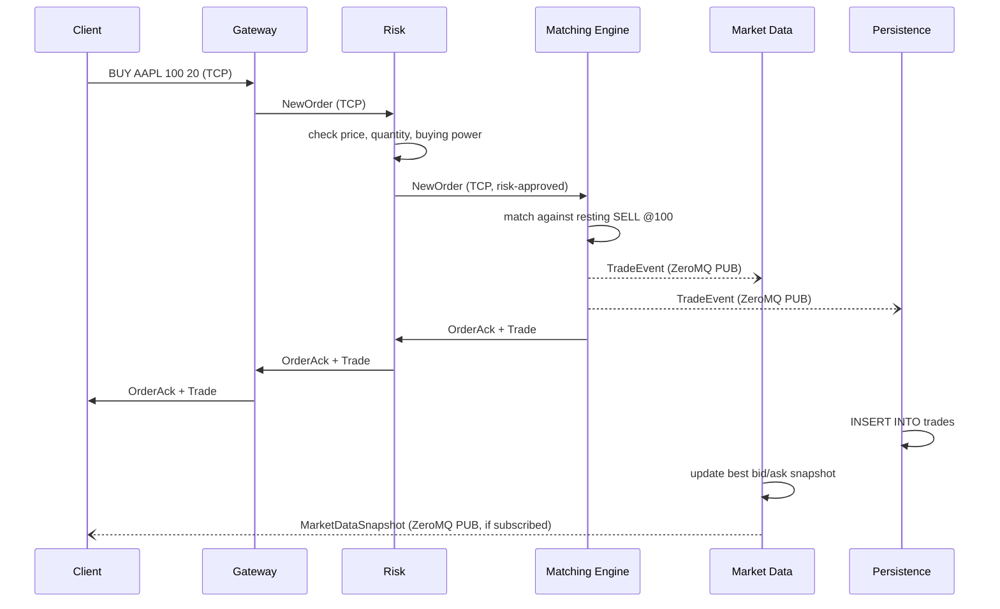
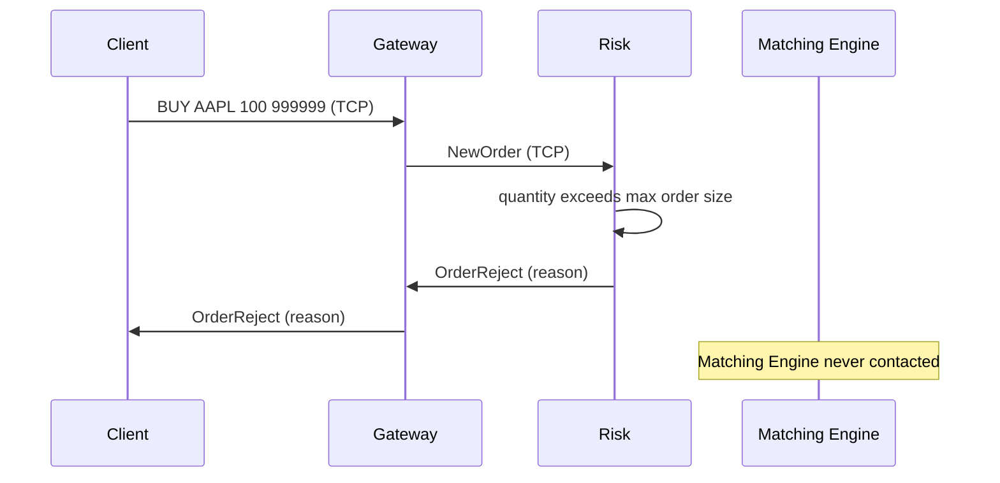
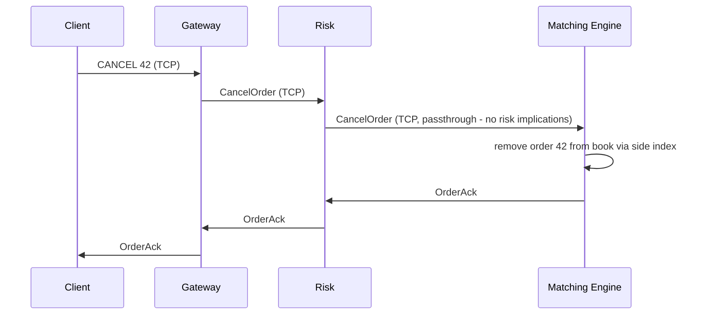

# Mini Exchange Simulator

A simplified electronic exchange, built to resemble the architecture of a real low-latency trading system: a TCP gateway, a single-threaded price-time-priority matching engine, a pre-trade risk gate, an event-driven persistence layer, and a market data publisher — all running as independent services, orchestrated with Docker Compose.

This is an educational project. The domain (limit orders, price-time priority, partial fills) and the architecture (service separation, single-threaded matching, pub/sub fan-out for trade events) are modeled closely on how real exchanges and trading venues are built; the specific implementation is intentionally scoped down (single instrument type, simplified risk checks, one account).

---

## Table of contents

- [Architecture overview](#architecture-overview)
- [Why these architectural decisions](#why-these-architectural-decisions)
- [How matching works](#how-matching-works)
- [Sequence diagrams](#sequence-diagrams)
- [Container and data structure choices](#container-and-data-structure-choices)
- [Project structure](#project-structure)
- [How to run](#how-to-run)
- [How Docker works here](#how-docker-works-here)
- [Testing](#testing)
- [CI](#ci)
- [Known simplifications](#known-simplifications)
- [Future improvements](#future-improvements)

---

## Architecture overview



Two distinct communication shapes exist in this system, deliberately using two different transports:

| Edge | Shape | Transport |
|---|---|---|
| Client ↔ Gateway ↔ Risk ↔ Matching Engine | 1:1, ordered, request/response | Plain TCP (Boost.Asio) |
| Matching Engine → {Persistence, Market Data, Client} | 1:many, fire-and-forget, unbounded consumers | ZeroMQ PUB/SUB |

A third option — a lock-free queue — was considered and ruled out categorically: it only works within one process's shared memory, and every service here runs in its own container/process. It remains the right tool *within* a single process (e.g. a future logging or metrics thread inside one service), just not across the service boundaries this project is built around.

---

## Why these architectural decisions

**Why TCP for the request chain:** Gateway→Risk→Matching Engine is a strict, ordered handoff — a client's order must be validated, then matched, in that exact sequence, and the caller needs the specific response to *its* specific request. Boost.Asio (already required for the Gateway's client-facing socket) gives us one networking library and one async pattern for every hop in this chain, at the cost of owning the wire framing ourselves (see [Container and data structure choices](#container-and-data-structure-choices) for the length-prefixed framing format).

**Why ZeroMQ for the event fan-out:** Matching Engine→{Persistence, Market Data} is a genuinely different shape — one producer, many independent, replaceable, never-replying consumers. Modeling that over raw TCP would mean the Matching Engine manually tracking connected subscribers, handling one going away or falling behind without blocking the others. ZeroMQ's PUB/SUB socket type provides this fan-out topology, with reconnection and slow-subscriber handling built in, essentially for free.

**Why Persistence never talks to the Matching Engine directly:** the Matching Engine publishes `Trade` events and knows nothing about PostgreSQL, connection strings, or SQL. Persistence subscribes to that feed independently. This means matching latency is never coupled to database write latency — a slow or down database cannot back up the order book.

**Why matching is single-threaded** — this is the one decision worth explaining in real depth, addressed in its own section below.

---

## How matching works

### Price-time priority

Each instrument has its own order book, split into a buy side and a sell side. Within each side, orders are ranked first by **price** (better prices match first: highest bid, lowest ask) and, among orders at the same price, by **time** (first-in, first-matched — strict FIFO).

When an incoming order arrives:
1. It's compared against the best price on the opposite side of the book.
2. If it crosses (a buy at or above the best ask, or a sell at or below the best bid), it matches against the resting order(s) at that price, oldest first, generating one `Trade` per match.
3. If the incoming order isn't fully filled by one resting order, it continues matching against the next order at that price level, then the next price level, until either it's fully filled or it no longer crosses the book.
4. Whatever quantity remains unfilled rests in the book at its own price, behind any existing orders at that price.

**Trade price convention:** every trade executes at the *resting* order's price, never the incoming (aggressor) order's price — the order that was already waiting gets its price honored; this is standard exchange convention, sometimes called maker-price execution.

### Why matching is single-threaded

This is deliberate, not a limitation to be fixed later, and it mirrors how real low-latency matching engines are actually built.

An order book is an inherently **sequential state machine**: every incoming order can affect what the very next order sees. Two orders arriving close together on the same book cannot be correctly processed "in parallel" without one waiting for the other's effect — there's no way around that without either serializing access (a lock) or risking incorrect trades from a race condition, which in a real exchange is a regulatory and financial failure, not just a bug.

Wrapping the book in a mutex doesn't help: every thread would still execute one at a time (the work inside the lock is fully serial regardless), while paying real costs — context switches, cache-line contention as the lock bounces between cores, non-deterministic latency from OS scheduling. You'd get every downside of multithreading and none of the upside.

The actual solution — and what this project does — is: **one thread owns one symbol's matching engine completely, with zero locks**, because there is no concurrent access to protect against by construction. This is why `OrderBook` and `MatchingEngine` contain no synchronization primitives at all.

**Scaling comes from sharding by symbol, not from parallelizing within a symbol.** AAPL's book and MSFT's book share no state, so each can run on its own single-threaded engine, on its own core, fully independently. The Matching Engine service already creates one `MatchingEngine` instance per symbol lazily — running N of them across N processes/machines, one per symbol, is the natural extension path (see [Future improvements](#future-improvements)).

### Partial fills, cancel, and modify

- **Partial fill:** if an incoming order's quantity exceeds one resting order's remaining quantity, it consumes that order fully and continues matching against the next one, potentially sweeping multiple price levels in a single submission.
- **Cancel:** removes a resting order by ID in O(1) average time via a side index (see below); cancelling an order that's already been filled or already cancelled is a normal outcome (returns "not found"), not an error — cancel-vs-fill races are routine in real trading.
- **Modify:** a quantity *decrease* preserves the order's existing time priority in its queue. A price change, or a quantity *increase*, forfeits time priority — the order is removed and re-submitted as if brand new, going to the back of its (possibly new) price level's queue, and is immediately re-matched in case the new terms now cross the book.

---

## Sequence diagrams

### Order submission (crossing order, generates a trade)



### Order rejected by Risk (never reaches the Matching Engine)



### Cancel



---

## Container and data structure choices

Every container choice below was made against a specific access pattern, not by default habit.

| Structure | Container | Why |
|---|---|---|
| Price levels (per side of book) | `std::map<Price, PriceLevel, Comparator>` | Keeps prices sorted; `begin()` is always the best price in O(1). `std::unordered_map` would be O(1) for lookup by a *specific* price, but we constantly need the *best* price, which a hash map can't give without scanning. Buy side uses `std::greater<Price>`, sell side `std::less<Price>` — same container type, opposite comparator, so the matching loop is templated over both. |
| Orders within one price level | `std::list<Order>` | Cancel is extremely common; erasing from the middle of a `vector`/`deque` is O(n) (shifts every later element), while `std::list::erase` given an iterator is O(1) — just relinks two pointers. We never need random-access indexing into a level, only front/back/erase-by-iterator, which is exactly what `std::list` provides and nothing more. Tradeoff accepted: worse cache locality than a contiguous container — named here as a deliberate, documented cost, not an oversight. |
| Order lookup by ID (cancel/modify) | `std::unordered_map<OrderId, OrderLocation>` | A side index alongside the price-level maps; callers only have an `OrderId`, so this avoids an O(n) scan across every price level. Relies on `std::list` iterators staying valid across insertions/erasures elsewhere in the list — the same property that made `std::list` correct for O(1) cancel also makes it safe to cache iterators here. |
| Wire protocol framing | Length-prefixed binary (`[4-byte length][1-byte type][payload]`) | TCP is a byte stream with no message boundaries. A length prefix means the reader always knows exactly how many bytes to wait for, with no escaping needed for binary payload data (unlike a delimiter character, which could collide with raw integer bytes). |
| Domain identifiers (`Price`, `Quantity`, `OrderId`, `BuyingPower`) | `StrongType<Tag, Underlying>` template (zero-overhead wrapper) | Prevents an entire class of unit-confusion bugs — passing a `Quantity` where a `Price` is expected — enforced at compile time, with zero runtime cost. |

---

## Project structure

```
exchange/
├── common/            # shared domain types, order book, matching engine, wire protocol, networking
├── gateway/            # client-facing TCP listener, format validation, IOrderProcessor abstraction
├── risk/               # pre-trade risk checks, forwards approved orders to matching_engine
├── matching_engine/    # price-time priority matching, publishes trades over ZeroMQ
├── market_data/        # subscribes to trades, maintains best bid/ask, republishes snapshots
├── persistence/        # subscribes to trades, writes to PostgreSQL
├── client/             # interactive console app (BUY/SELL/CANCEL/MODIFY/BOOK/TRADES)
├── tests/              # one <service>_tests executable per module, GoogleTest + CTest
├── docs/                # schema.sql
├── docker/              # one Dockerfile per service (two-stage: build + slim runtime)
├── docker-compose.yml
└── .github/workflows/ci.yml
```

Every service links a shared `common` static/interface library rather than depending on each other directly — this is Clean Architecture applied at the build-system level: shared vocabulary lives in one place, and services never reach into another service's internals.

---

## How to run

### Prerequisites

- CMake ≥ 3.25, a C++20 compiler (MSVC 2022, GCC 13+, or Clang 17+)
- Boost ≥ 1.83 (`libboost-system-dev` on Ubuntu, `vcpkg install boost-asio boost-system` on Windows)
- ZeroMQ (`libzmq3-dev`) and cppzmq (fetched automatically via CMake `FetchContent`)
- libpqxx + libpq (`libpqxx-dev libpq-dev`) — only required to build `persistence_service`
- Docker + Docker Compose, for the full containerized stack

### Build & test locally

```bash
cmake -S . -B build
cmake --build build
ctest --test-dir build --output-on-failure
```

### Run the full stack with Docker Compose

```bash
docker compose up --build -d gateway risk matching_engine market_data persistence postgres
docker compose run --rm client
```

The `client` service needs `run --rm` (rather than being included in the detached `up`) because it's the one interactive service in the system — see [How Docker works here](#how-docker-works-here) for why.

```
> SELL AAPL 100 50
ACK order_id=1 (resting, no trade yet)
> BUY AAPL 100 20
ACK order_id=2 trades:
    price=100 qty=20 buy_id=2 sell_id=1
> BOOK AAPL
Book: AAPL
  BIDS:
  ASKS:
    100  qty=30  orders=1
> QUIT
```

### Verify persisted trades

```bash
docker compose exec postgres psql -U exchange -d exchange -c "SELECT * FROM trades;"
```

---

## How Docker works here

Every service Dockerfile uses a **two-stage build**: a `build` stage carrying the full toolchain (compiler, CMake, dev headers for Boost/ZeroMQ/libpqxx), and a slim `runtime` stage that copies out only the compiled binary plus the *runtime* shared libraries. `COPY --from=build` is what makes this possible — nothing from the builder stage except the one named binary ends up in the final image, keeping runtime images dramatically smaller than the toolchain needed to produce them.

`docker-compose.yml` orchestrates all six backend services plus the client, using Compose's built-in DNS: each service resolves every other service by its YAML key as a hostname (e.g. `MATCHING_ENGINE_HOST=matching_engine`) on the private network Compose creates automatically. Every service reads its downstream host/port from environment variables with sensible `localhost` defaults, so the exact same binary works identically whether run directly on a developer's machine or inside Compose — no code change, no separate build.

**Startup ordering:** `depends_on` in Compose controls container *start* order, not whether the dependency's listener is actually accepting connections yet. Every service that depends on another (Risk→Matching Engine, Gateway→Risk, Persistence→Postgres) retries its connection attempt with a short backoff for up to ~5 seconds before giving up — a simple, honest fix for that real startup race, rather than assuming `depends_on` guarantees readiness.

---

## Testing

Each service has its own `<service>_tests` executable (GoogleTest + CTest), following one consistent principle throughout the project: **test logic, not plumbing**. Anything that touches a real socket, a real database, or real IPC is deliberately isolated behind an interface (`IOrderProcessor`, `ITradeRepository`, `MessageDispatcher`/`MatchingDispatcher`/`RiskDispatcher` operating on already-decoded frames) so the actual business logic — matching, risk checks, framing, command parsing — can be tested fast and deterministically with plain data, no network or database required.

The exception is a small number of genuine **integration tests** (`RiskDispatcherIntegrationTests`, `EndToEndIntegrationTests`) that spin up real `FrameServer`s on loopback ports inside the test binary, proving the actual multi-hop TCP chain (Gateway→Risk→Matching Engine) works end-to-end without requiring Docker to verify it.

```bash
ctest --test-dir build --output-on-failure
```

## CI

Every push and pull request to `main` runs three parallel GitHub Actions jobs:
- **clang-format check** — fails in seconds if code isn't formatted per `.clang-format`, before any compilation happens
- **Build & Test** — full CMake configure, build, and `ctest` run on Ubuntu (matching the Docker/production environment)
- **clang-tidy** — static analysis against `compile_commands.json`, scoped to this project's own source (never the fetched GoogleTest/cppzmq dependencies)

A local `scripts/check.sh` mirrors this pipeline exactly, so failures are discoverable in seconds locally rather than as a surprise after pushing.

---

## Known simplifications

Named explicitly here rather than silently glossed over — each of these was a deliberate scope decision for an educational project, not an oversight:

- **Client-generated Order IDs** use a local atomic counter per client process. Fine for one client at a time; a real multi-client exchange needs centrally-assigned or namespaced IDs to guarantee global uniqueness.
- **Market Data's best-bid/ask is derived only from trade prices**, since Market Data only ever sees the trade event stream, never the real order book, per the original design. This is an approximation of top-of-book, not a true one.
- **Synchronous internal TCP clients** (Gateway→Risk, Risk→Matching Engine) block their calling service's single thread for the duration of each round-trip. Acceptable at this project's scale; a real throughput-sensitive system would use an async/pipelined client or a connection pool.
- **Single account, single risk profile** — Risk holds one demo `Account`; there's no per-client or per-user account lookup.
- **`TRADES` blocks the console** until `QUIT` rather than streaming in the background while still accepting other commands, to avoid a race between two threads both writing to `std::cout`.

---

## Future improvements

Extension points deliberately left open by the current design:

- **Additional order types:** Market, Stop, Iceberg — the `OrderType` enum and `MatchingEngine::submitOrder` are structured to accept new order-type handling without restructuring the core book.
- **FIX protocol** support at the Gateway, as an alternative to the current custom binary framing.
- **Kafka** as a durable, replayable alternative (or complement) to the current ZeroMQ trade-event fan-out, for consumers that need replay/at-least-once delivery guarantees ZeroMQ PUB/SUB doesn't provide.
- **Redis** for shared, low-latency caching of market data snapshots across multiple Market Data replicas.
- **Replication** of Persistence and Market Data for high availability.
- **Multiple matching engines / sharding by symbol** as genuinely separate processes — the current design (one `MatchingEngine` instance per symbol, created lazily, zero cross-symbol state) already supports this; it's an operational/deployment extension, not a redesign.
- **Async/pipelined internal TCP clients** or a connection pool, to remove the blocking-round-trip throughput ceiling noted above.
- **Centrally-assigned Order IDs**, to support genuinely concurrent multiple clients correctly.
- **A real top-of-book market data feed**, published directly by the Matching Engine alongside trade events, rather than Market Data's current trade-price approximation.

---

## License

Educational project — no license restrictions implied beyond standard use.
